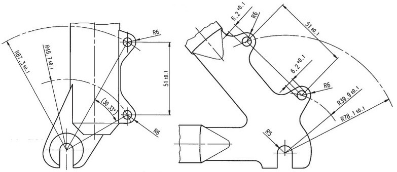

# makerjs-disc-brake-mount-is
Disc brake mounting bolt patterns - front and rear, International Standard - for Maker.js

Based on this specification:

source: [Art's Cyclery Blog](http://blog.artscyclery.com/keeping-the-rubber-side-down/rubber-side-down-disc-brake-adapters/)
